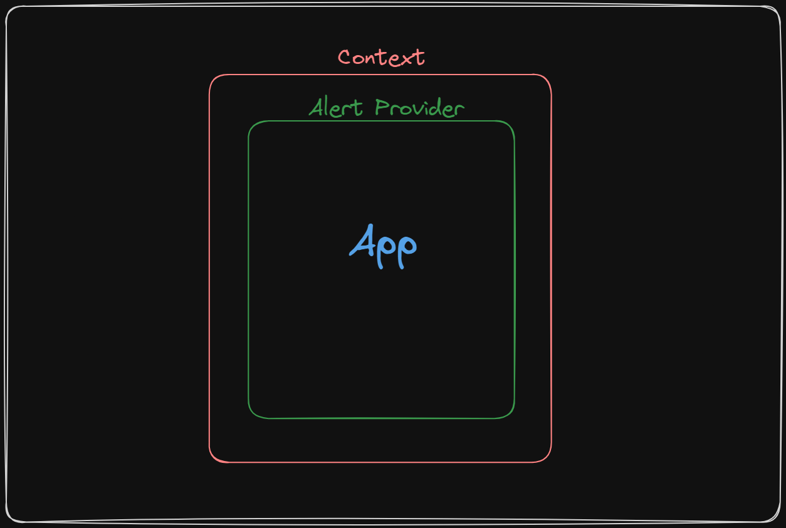
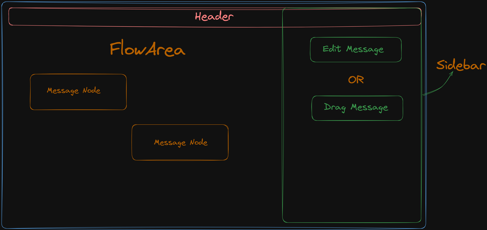

# Chatbot Flow

We have built a simple Chatbot flow builder using React and tried to make the code extensible to easily add new features.

## Features

- The ability to add different messages by dragging and dropping from the sidebar
- The ability to edit any particular message by clicking on it and filling up whatever details it needs
- Making sure that edges are connectable between two different nodes
- Save changes feature that makes sure you can save your stuff but not when there are multiple unattended nodes

## Code Overview

Divided the code into different components to make it more readable and maintainable. The main components are:
- App.jsx
- Sidebar.jsx
- MessageNode.jsx
- Header.jsx
- FlowArea.jsx

- The app dot JX is the parent component that houses many other components inside of it as shown in the diagram above.
- For simplicity and quickness of the work, React context is being used simply for a global level state management so that instead of prop drilling we can easily use basic states across the entire application.
- Then we have our react flow along with a couple of custom props that are found easily in its documentation which has been passed to make the product quality even better.
- Last but not least we have our messaging nodes which are the blocks with source and target to connect different edges to different nodes
- The sidebar is the place from where we can drag and drop these nodes and once we click on a node the sidebar also turns into an editing sphinx where we can edit the message of a node

### Header and Saving Functionality

This code controls a save button in a web application's header. Here's what it does:

* It connects to other parts of the application to get information about the data you're working with.
* The save button only works if you've added at least one item. It checks this before saving.
* If you try to save with more than one specific type of item, where some nodes are unconnected it gives an error message explaining why it can't save.
* There are also logics preventing you from connecting multiple nodes to a single node.
* If everything is good, clicking the button will show a success message saying "Flow saved."

## Link
https://assignment1.tamal.codes/
